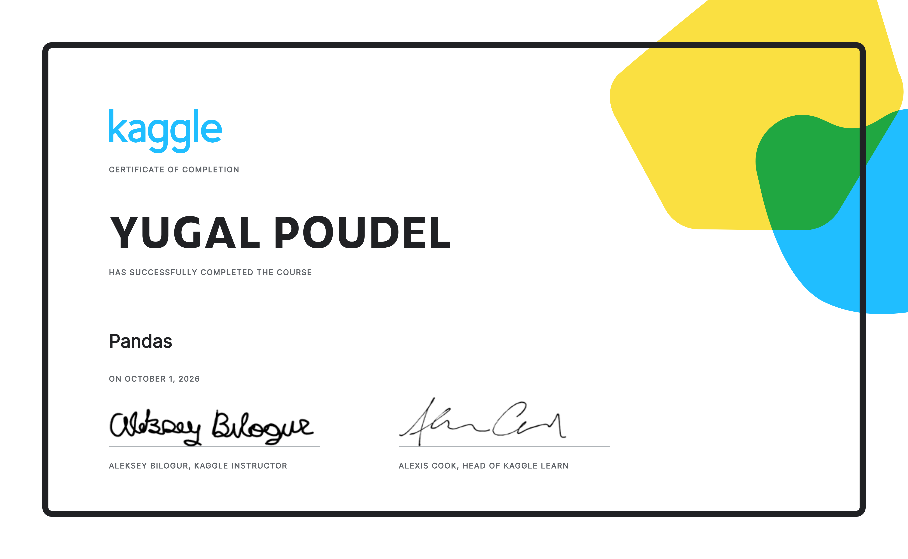

[🏠 **Main Repository**](../README.md) &nbsp;•&nbsp; [⏮️ **Previous module: pandas User Guide**](../pandas%20-%20official%20User%20Guide/README.md)

---

# 🐼 Kaggle Learn — Pandas (Week 6)

### *Six short lessons, six exercise notebooks, one certificate*

[](#-certificate)
[](#-the-six-lessons)
[](#-the-six-lessons)
[](#-certificate)
[](https://www.kaggle.com/learn/pandas)

> [!NOTE]
> **Roadmap assignment:** the free [Kaggle Learn Pandas course](https://www.kaggle.com/learn/pandas): six hands-on lessons, each followed by an auto-checked exercise.
> **Why it sits next to the User Guide:** the User Guide explains *how pandas works*; these exercises are fast, graded reps that make the common moves automatic. Most of them use the same **Wine Reviews** dataset (130k reviews), so every lesson asks a real question of real data.

---

## 🏆 Certificate

<p align="center">
  
</p>

<p align="center"><b>Certificate of Completion: Pandas</b> · Kaggle Learn · awarded <b>1 October 2026</b></p>

---

## 📚 The six lessons

| # | Lesson | Exercise notebook | Checks | Core moves practised |
| :-: | :--- | :--- | :-: | :--- |
| 1 | Creating, Reading and Writing | [`01_creating-reading-and-writing`](Notebooks/01_creating-reading-and-writing.ipynb) | ✅ 5 / 5 | `pd.DataFrame`, `pd.Series` (with `index=` and `name=`), `read_csv(index_col=0)`, `to_csv` |
| 2 | Indexing, Selecting & Assigning | [`02_indexing-selecting-and-assigning`](Notebooks/02_indexing-selecting-and-assigning.ipynb) | ✅ 9 / 9 | Column access, `.iloc` vs `.loc`, label lists, boolean masks with `&` / `\|`, `isin` |
| 3 | Summary Functions and Maps | [`03_summary-functions-and-maps`](Notebooks/03_summary-functions-and-maps.ipynb) | ✅ 7 / 7 | `median`, `unique`, `value_counts`, centring with `- mean()`, `idxmax`, `map`, `apply` |
| 4 | Grouping and Sorting | [`04_grouping-and-sorting`](Notebooks/04_grouping-and-sorting.ipynb) | ✅ 6 / 6 | `groupby().size()`, `agg(["min", "max"])`, `sort_values` on several columns, `sort_index`, a `{country, variety}` MultiIndex |
| 5 | Data Types and Missing Values | [`05_data-types-and-missing-values`](Notebooks/05_data-types-and-missing-values.ipynb) | ✅ 4 / 4 | `dtype`, `astype(str)`, `isnull().sum()`, `fillna("Unknown")` before counting |
| 6 | Renaming and Combining | [`06_renaming-and-combining`](Notebooks/06_renaming-and-combining.ipynb) | ✅ 4 / 4 | `rename(columns=...)`, `rename_axis`, `concat` (Reddit tables), `join` with suffixes (Powerlifting meets + competitors) |
| | **Total** | **6 notebooks** | ✅ **35 / 35** | |

*Hint/solution cells are left commented out; every "Correct" in the notebooks was earned on the check.*

---

## 🔍 Questions answered along the way

A few of the exercise questions are small analyses in their own right:

* **Best bargain wine:** the title with the highest `points / price` ratio (`idxmax`), lesson 3.
* **"Tropical" or "fruity"?** Counting descriptions that contain each word, lesson 3.
* **Best wine for your money:** maximum points at each price, sorted by price, lesson 4.
* **Most expensive varieties:** min and max price per variety, sorted by both, lesson 4.
* **Most common regions:** `region_1` counts *after* filling missing values with `"Unknown"`, so the missing rows are counted instead of silently dropped, lesson 5.

---

## 🔗 How it maps onto the pandas User Guide notebooks

| Kaggle lesson | Matching User Guide notebook | What the User Guide adds |
| :--- | :--- | :--- |
| 2 · Indexing, Selecting & Assigning | [01 — Indexing and selecting data](../pandas%20-%20official%20User%20Guide/Notebook/01_Indexing%20and%20selecting%20data.ipynb) · [02 — Copy-on-Write](../pandas%20-%20official%20User%20Guide/Notebook/02_Copy%20on%20Write.ipynb) | Inclusive `.loc` slices, `where` / `mask`, `query()`, and why assignment must be one `.loc` step |
| 4 · Grouping and Sorting | [05 — Group by](../pandas%20-%20official%20User%20Guide/Notebook/05_Group%20by%20split-apply-combine.ipynb) · [03 — MultiIndex](../pandas%20-%20official%20User%20Guide/Notebook/03_MultiIndex%20%26%20advanced%20indexing.ipynb) | Named aggregation, `transform`, filtration, and slicing the MultiIndex that `groupby` returns |
| 3 · Summary Functions and Maps | [05 — Group by](../pandas%20-%20official%20User%20Guide/Notebook/05_Group%20by%20split-apply-combine.ipynb) (*Flexible apply*) | Why `apply` / `map` is the slow path and when a vectorised method replaces it |
| 6 · Renaming and Combining | [04 — Merge, join, concatenate](../pandas%20-%20official%20User%20Guide/Notebook/04_Merge%20join%20concatenate.ipynb) | `merge` types, `validate=` and `indicator=True` to check every join |
| 5 · Data Types and Missing Values | [Working with missing data](https://pandas.pydata.org/docs/user_guide/missing_data.html) (bridge page) | *Why* data is missing decides whether to drop, fill or flag it; more in Kaggle Learn — Data Cleaning |

---

## 📂 Folder contents

```text
Kaggle Learn - Pandas/
├── README.md                                   # This page
├── kaggle-pandas-certificate.png               # Certificate of completion (1 Oct 2026)
└── Notebooks/
    ├── 01_creating-reading-and-writing.ipynb
    ├── 02_indexing-selecting-and-assigning.ipynb
    ├── 03_summary-functions-and-maps.ipynb
    ├── 04_grouping-and-sorting.ipynb
    ├── 05_data-types-and-missing-values.ipynb
    └── 06_renaming-and-combining.ipynb
```

> [!TIP]
> The notebooks were run on Kaggle, where the datasets and the `learntools` answer checker are already attached. To rerun one, open the lesson from the [course page](https://www.kaggle.com/learn/pandas) and copy the cells across; locally, the `q1.check()` cells and `../input/...` paths will not work.

---

[🏠 **Main Repository**](../README.md) &nbsp;•&nbsp; [⏮️ **Previous module: pandas User Guide**](../pandas%20-%20official%20User%20Guide/README.md)
