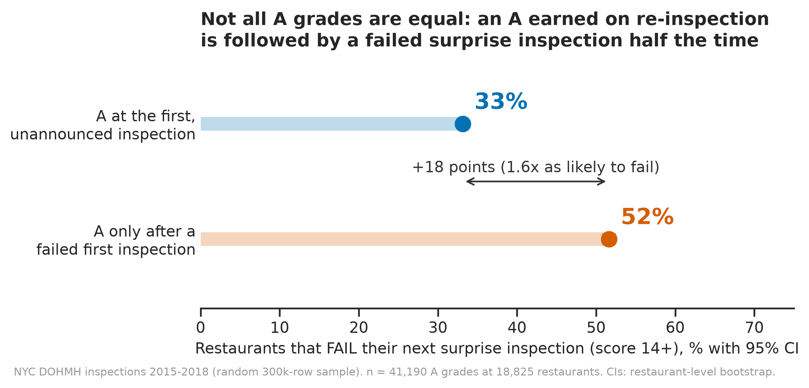
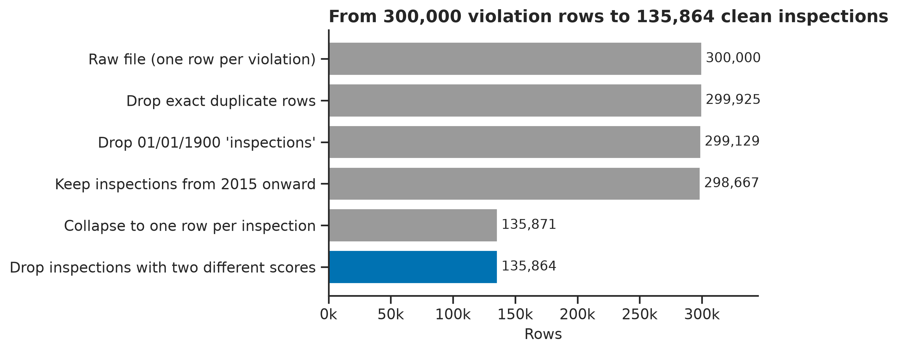
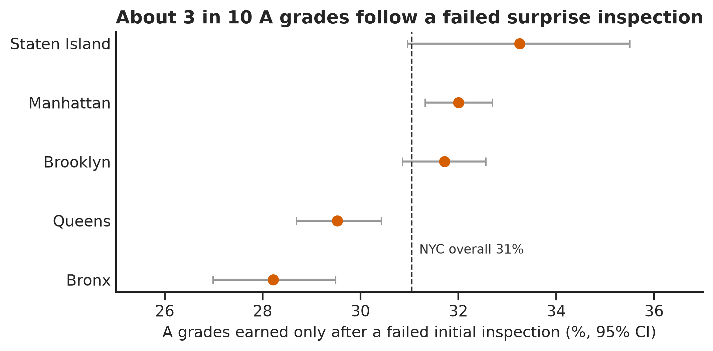
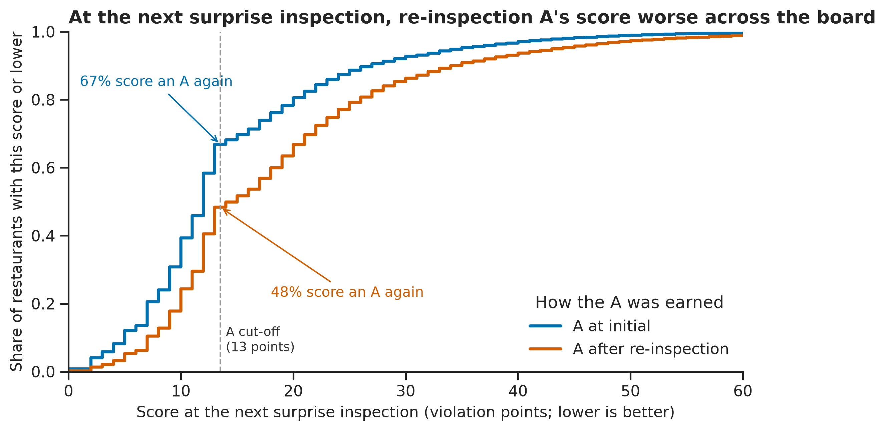
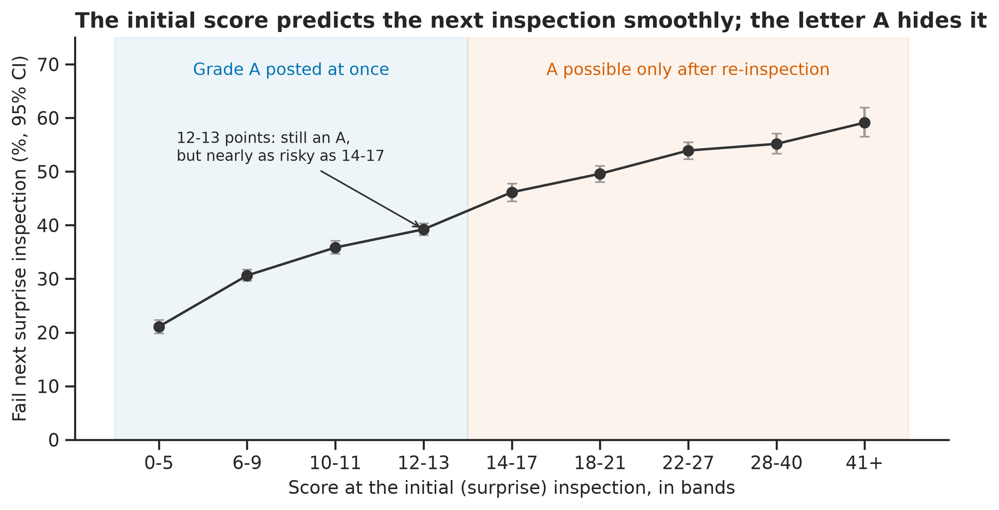
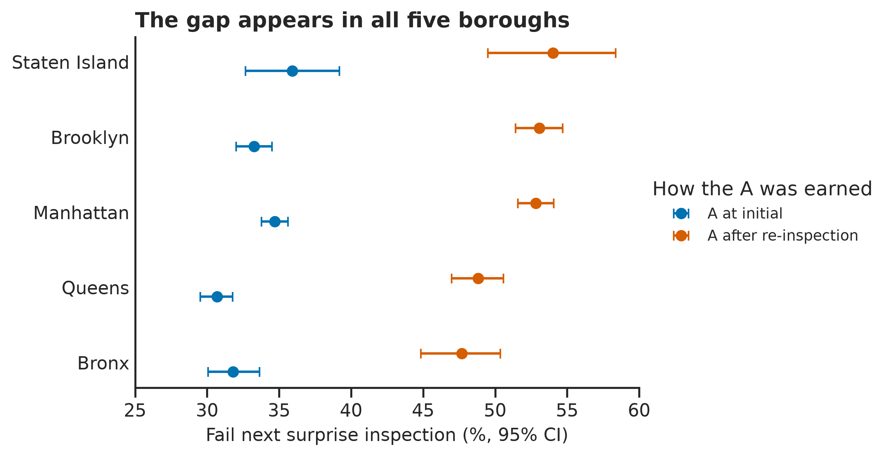
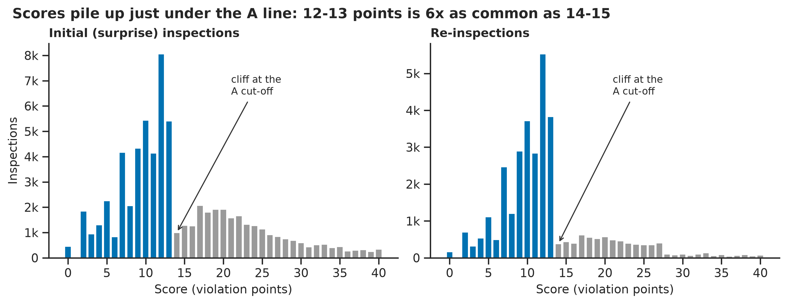

[🏠 **Main Repository**](../README.md)  •  [**Gate 2 worked solutions** ⏭️](../Gate%202%20-%20worked%20solutions/README.md)

---

# 🍽️ P1 — Does an "A" Mean the Same Thing Twice?

### *What New York City's restaurant grade card hides, from 300,000 rows of real inspection data*

[-blue?style=flat-square)](data/README.md)
[](#-results)
[](#-how-to-run-it)
[](#)

## ❓ The question (written before any analysis)

> **Does an "A" in a New York City restaurant's window mean the same thing whether it was earned at the first, unannounced inspection or only after a re-inspection?**

New York grades restaurants by **violation points (lower is better): 0-13 = A, 14-27 = B, 28+ = C**. A restaurant that scores 14 or more at its surprise inspection gets no grade that day. It is re-inspected about a month later, and **the grade card is based on the re-inspection**. So the same A card can mean "clean on a surprise visit" or "failed the surprise visit, then passed a visit it was expecting". A diner can't tell which.

## ✅ The answer

**No. An A earned only on re-inspection is a weaker A.**



- **31.1%** of A grades (95% CI 30.6% to 31.5%) were earned only after a failed surprise inspection.
- At the **next** surprise inspection, restaurants with a re-inspection A **failed 51.6%** of the time (95% CI 50.8% to 52.4%), against **33.1%** (32.6% to 33.7%) for restaurants that got their A first time.
- That's a gap of **18.5 percentage points (95% CI 17.5 to 19.5)**, or **1.56x the risk** (1.52 to 1.59). The mean next score is 4.2 points worse (4.0 to 4.5).
- The gap appears in **all five boroughs**, survives keeping only one A per restaurant (permutation test p < 0.001), and points the same way in every robustness check.
- **Why:** the surprise-inspection score predicts the next inspection smoothly (figure 4). The letter A throws that information away.

---

## ▶️ How to run it

Needs Python 3.10+ and an internet connection for the first step (the raw file is 96 MB).

```bash
# from this folder
pip install -r requirements.txt
python run_all.py
```

`run_all.py` does three things, about 2 minutes after the download:

1. `src/download_data.py` downloads the raw CSV into `data/raw/` and **checks its SHA-256 checksum**, so you know you have the exact file used here.
2. Runs [`notebooks/01_data_quality_and_cleaning.ipynb`](notebooks/01_data_quality_and_cleaning.ipynb) → tidy tables in `data/processed/` (CSV + a DuckDB database).
3. Runs [`notebooks/02_analysis_and_figures.ipynb`](notebooks/02_analysis_and_figures.ipynb) → `figures/*.png` (300 dpi) and `results/key_numbers.json`.

**Check you reproduced it:** open `results/key_numbers.json`. `fail_next_A_after_reinspection` should start with `0.5163` and `fail_next_A_at_initial` with `0.3313`. (Bootstrap intervals use fixed seeds, so they match too.)

Prefer clicking? Run `python src/download_data.py`, then open the two notebooks in Jupyter and choose *Run All*, in order.

---

## 🗂️ Data

| | |
| :-- | :-- |
| **Source** | NYC Department of Health, [Restaurant Inspection Results](https://data.cityofnewyork.us/Health/DOHMH-New-York-City-Restaurant-Inspection-Results/43nn-pn8j), NYC Open Data, extracted December 2018 |
| **Copy used** | a 300,000-row **random sample** of that extract published by [TidyTuesday](https://github.com/rfordatascience/tidytuesday/tree/master/data/2018/2018-12-11) (the full file is over GitHub's 100 MB limit) |
| **Unit** | one row per **violation** cited at one inspection |
| **After cleaning** | 135,864 inspections of 25,744 restaurants, January 2015 to December 2018 |

Column-by-column dictionary: [`data/README.md`](data/README.md).

## 🧹 Cleaning decisions (each with a reason and row counts)

The quality report (`data_quality_report(df)` in `src/cleaning.py`) found duplicates, placeholder dates, an encoding error, impossible scores, a text "Missing" value and zip codes stored as floats.

| # | Step | Why | Rows before | Rows after |
| :-: | :-- | :-- | --: | --: |
| 1 | Drop exact duplicate rows | identical in every column; no extra information | 300,000 | 299,925 |
| 2 | Drop `01/01/1900` "inspections" | the data dictionary says this date means *not yet inspected*; these rows have no score and no type | 299,925 | 299,129 |
| 3 | Keep 2015 onward | only 462 stray rows from 2012-2014; a consistent 4-year window | 299,129 | 298,667 |
| 4 | Fix `Café` → `Café`; fill 23 `Missing` boroughs from zip code | UTF-8 text read as Latin-1; every other row with zip 11249 is in Brooklyn | 298,667 | 298,667 |
| 5 | Negative scores → missing | 65 scores of -1; points can't be negative | 298,667 | 298,667 |
| 6 | Collapse to one row per inspection | score and grade belong to the inspection, not the violation row | 298,667 | 135,871 |
| 7 | Drop inspections with two different scores | 7 inspections; no way to tell which score is final | 135,871 | 135,864 |

**Deliberately kept:** missing grades (a failed surprise inspection *gets* no grade; the gap is information), unscored programs such as Smoke-Free Air Act checks (filtered out later, not deleted), missing zip codes. A `derived_grade` from the score agrees with the official grade on **99.4%** of 75,265 inspections; almost all disagreements are reopening inspections that keep the C from the closure.



## 🔬 Method

1. Keep scored **cycle inspections** (the routine programme): initial inspections and re-inspections.
2. Find every A and label how it was earned:
   - **A at initial:** surprise inspection scored 0-13;
   - **A after re-inspection:** surprise inspection scored 14+, and the next cycle inspection, a re-inspection within 120 days, scored 0-13.
3. Follow each A to the restaurant's **next surprise (initial) inspection**. Outcome: did it **fail** (14+)? Also the next score itself.
4. **Uncertainty:** the same restaurant appears many times, so every 95% CI comes from a **cluster bootstrap** that resamples whole restaurants (2,000 resamples, fixed seed). A **permutation test** on one A per restaurant (independent units, 10,000 shuffles) checks the difference isn't noise.
5. **Robustness:** one A per restaurant only; grades from 2015-2016 only (longer follow-up); split by time until the next inspection.

59,896 A grades were found; 41,190 (at 18,825 restaurants) have a later surprise inspection in the data and enter the comparison.

---

## 📊 Results

### 1. About 3 in 10 A grades follow a failed surprise inspection



From 28% in the Bronx to 33% on Staten Island; 31.1% city-wide.

### 2. Those restaurants do worse at the next surprise inspection, across the whole score range



The re-inspection-A curve is to the right of the first-time-A curve everywhere, so the result isn't created by where the pass/fail line is drawn. Only **48%** of re-inspection A's score an A again at the next surprise visit, against **67%**.

### 3. Why: the surprise-inspection score carries the information; the letter hides it



The chance of failing the next surprise inspection climbs steadily, from about 1 in 5 for restaurants that scored 0-5 to about 3 in 5 for 41+. There's no jump at 13/14. A restaurant that scored 12 and one that scored 30 and then 10 on re-inspection display the same card.

### 4. The gap appears in every borough



### 5. Context: an A is often a narrow pass



Surprise inspections score 12-13 points **5.9x as often** as 14-15 (95% CI 5.6 to 6.2), and re-inspections 11.3x. Violations carry fixed point values, so the histogram is bumpy everywhere, but nowhere else does it fall off a cliff like this. That fits FiveThirtyEight's 2014 reporting on NYC grades, but this data can't say whether it comes from inspector discretion or from restaurants working hard to stay under the line.

### Robustness checks (fail-rate gap, re-inspection A minus first-time A)

| Check | n | First-time A fails | Re-inspection A fails | Gap (95% CI) |
| :-- | --: | --: | --: | :-- |
| All A grades (main result) | 41,190 | 33.1% | 51.6% | **+18.5** (17.5 to 19.4) |
| First A per restaurant only | 18,825 | 32.2% | 51.4% | +19.2 (17.8 to 20.7) |
| A posted 2015-2016 (longer follow-up) | 22,820 | 32.3% | 48.2% | +15.9 (14.5 to 17.2) |
| Next inspection < 8 months later | 15,560 | 44.9% | 51.9% | +7.0 (5.0 to 9.1) |
| Next inspection 8-14 months later | 18,865 | 31.8% | 52.1% | +20.3 (18.2 to 22.5) |
| Next inspection > 14 months later | 6,765 | 30.9% | 36.5% | +5.6 (-0.0 to 11.2) |

*(Robustness CIs use 1,000 bootstrap resamples, so the first row's upper bound differs by 0.1 point from the 2,000-resample headline.)*

The gap always points the same way, but it is much smaller when the next inspection comes unusually soon or late, and the small > 14-month group (282 re-inspection A's) is inconclusive on its own. Timing matters (see Limitations).

**A check I rejected, and why:** comparing the two routes *within the same restaurant* reverses the sign (56% vs 40%). With only ~3.5 years of data, a restaurant only shows both routes if it alternates: an A at initial followed by a failed surprise visit, then an A after re-inspection followed by a pass. Picking restaurants on that pattern means picking on the outcome, so the comparison is biased by construction.

---

## ⚠️ Limitations: what this analysis cannot prove

1. **It is not causal.** It shows what a re-inspection A *predicts*, not that re-inspections are lax or that the grading system makes restaurants worse. The likely explanation is simply that the surprise score measures a restaurant's usual standard, and the re-inspection measures how well it prepares for an expected visit.
2. **Regression to the mean works in the restaurants' favour, not against them.** A bad surprise score includes some bad luck, so these restaurants *should* improve on average, and they do (mean 24.6 → 18.7 points). The finding is that they don't improve to the level of first-time A restaurants (14.4).
3. **Sampled rows, not a full census.** The file is a random 300,000-row sample of violation rows. An inspection with only one or two violations is more likely to be missing entirely, so some "next" inspections are actually later ones, and clean inspections are slightly under-represented. Both groups are affected; I can't measure exactly how much.
4. **Inspection timing is not random.** The city inspects restaurants with worse scores more often. The gap shrinks to about 6-7 points when the next inspection is unusually soon or late (robustness table), so part of the main gap may come from comparing different points in the inspection schedule.
5. **Survivorship.** The city's extract only covers restaurants with an active permit in December 2018. Restaurants that closed earlier are missing. If the worst ones closed most often, the true gap is probably larger than measured, but this can't be checked with this file.
6. **Scores are not food-safety outcomes.** Nothing here measures food-borne illness. A high score is a count of violations an inspector saw on one day.
7. **2015-2018 only.** NYC's rules and inspection practices have changed since (including during COVID-19). The result describes that period.

---

## 📁 Project structure

```text
P1 - NYC Restaurant Grades/
├── README.md                     ← you are here
├── requirements.txt
├── run_all.py                    ← one command: download → clean → analyse
├── data/
│   ├── README.md                 ← source, licence, column dictionary
│   ├── raw/                      ← nyc_restaurants.csv (downloaded, not in git)
│   └── processed/                ← tidy CSVs + nyc_inspections.duckdb (generated, not in git)
├── notebooks/
│   ├── 01_data_quality_and_cleaning.ipynb
│   └── 02_analysis_and_figures.ipynb
├── src/
│   ├── download_data.py          ← download + SHA-256 check
│   ├── cleaning.py               ← data_quality_report(df) and every cleaning step
│   ├── analysis.py               ← inspection cycles, cluster bootstrap
│   ├── plotting_utils.py         ← set_style(), colour-blind palette, save() at 300 dpi
│   └── paths.py
├── figures/                      ← fig1 ... fig7 (300 dpi PNG)
└── results/
    ├── key_numbers.json          ← every number quoted in this README
    └── robustness_checks.csv
```

## 🔁 Reproducibility

- Built and run on 2 October 2026 with Python 3.11, pandas 3.0.2, numpy 2.4.4, matplotlib 3.11.2, seaborn 0.13.2, duckdb 1.5.6.
- Every random step has a fixed seed (bootstrap 2026, permutation 2026), so re-running gives identical numbers.
- The raw file is verified by checksum before anything runs.

## 🔗 Where this fits

Month 2 of the [12-month plan](../README.md), "From raw data to a real answer". It uses the cleaning from the [pandas User Guide](../pandas%20-%20official%20User%20Guide/README.md) and [Kaggle Data Cleaning](../Kaggle%20Learn%20-%20Data%20Cleaning/README.md) modules, the charts from [matplotlib](../matplotlib%20-%20official%20tutorials/README.md) and [seaborn](../seaborn%20-%20official%20tutorial/README.md), and the permutation-test and confidence-interval ideas from the [StatQuest hypothesis-testing notes](../StatQuest%20-%20hypothesis%20testing%20set/README.md). The cleaned tables are queried in SQL in the [Gate 2 worked solutions](../Gate%202%20-%20worked%20solutions/README.md).
